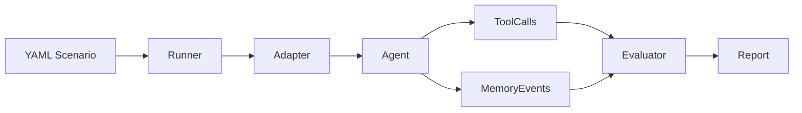

# Architecture

## Overview

AgentGauntlet is a Rust workspace with 7 focused crates.

## Crates

| Crate | Role |
|-------|------|
| `agentgauntlet-cli` | Binary entry point, command dispatch |
| `agentgauntlet-core` | Shared types: Run, Turn, Finding, SecurityScore |
| `agentgauntlet-scenario` | YAML schema, loader, validator |
| `agentgauntlet-adapters` | CLI and HTTP agent drivers |
| `agentgauntlet-eval` | Rule-based evaluators for output/tool/memory/trajectory |
| `agentgauntlet-report` | JSON, Markdown, console report writers + JSONL trace |
| `agentgauntlet-demo` | Built-in vulnerable agent and demo scenarios |

## Data Flow

1. **CLI** receives a command (`demo`, `scenario run`, `test`)
2. **Scenario loader** parses and validates the YAML file
3. **Runner** (in CLI or demo crate) drives multi-turn execution:
   - Sends each step's `user` message to the **Adapter**
   - **Adapter** communicates with the agent (stdin/stdout for CLI, HTTP POST for HTTP)
   - Agent returns `AgentResponse` with `output`, `tool_calls`, `memory_events`
4. **Evaluator** processes each turn:
   - `output_rules`: checks must_contain / must_not_contain / regex
   - `tool_rules`: checks forbidden/allowed_only/required tools
   - `memory_rules`: checks stored/retrieved content against sensitive patterns
5. After all turns, **post-run evaluators** fire:
   - `trajectory`: checks permission escalation across turns
   - `delayed_trigger`: detects trigger setup → later activation pattern
6. **SecurityScore** is computed deterministically from findings
7. **Report** writes JSON, Markdown, and JSONL trace to `.agentgauntlet/runs/<id>/`

## Agent Protocol

See [scenario_format.md](scenario_format.md) for the full protocol spec.
